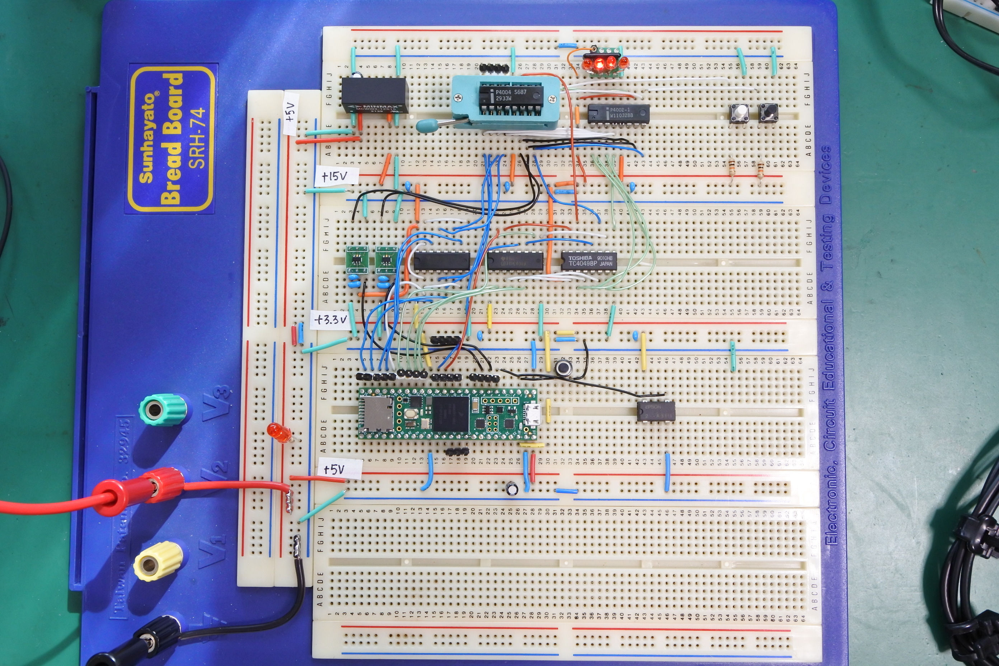

# Teensy-4001
Intel 4001 (MCS-4 mask ROM) emulator using Teensy 4.1

This document is written mostly in Japanese. If necessary, please use a translation service such as DeepL (I recommend this) or Google.

## 概要
Teensy4.1とレベル変換用のICでIntel 4001のROM機能を実装しました．4004, 4002に継げてLチカが動きました．DCDCコンバータで+15Vを生成しているので+5Vの単一電源で動きます．

## 実装した機能
- 4001のROM機能
- 2相クロック生成

## 制限事項等
- 4001のポート機能は未実装です．

## 動画
Youtubeで関連動画を公開しています．
- https://www.youtube.com/@ryomukai/videos

## ブログ
関連する情報が書いてあるかも．
- [Intel 4004 関連記事の目次@ブログの練習](https://blog.goo.ne.jp/tk-80/e/3fa1e2972737c7b7d1b83f4e7bd648a2)

## 更新履歴
- 2023/5/10: 初版公開
